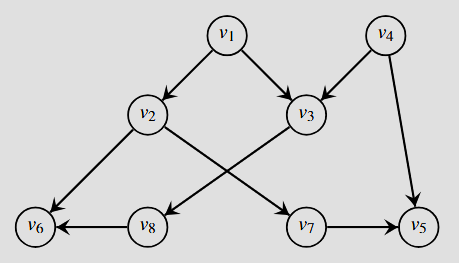

# 2º Projeto

## Descrição do Problema

Uma árvore genealógica consiste num grafo dirigido em que cada nó representa uma pessoa e os vizinhos diretos de um nó correspondem aos seus filhos, podendo existir nós órfãos, nós com um progenitor e nós com dois progenitores. Dados dois nós $P1$ e $P2$ de uma árvore genealógica:

- $P1$ diz-se _ancestral_ de $P2$ se é possível atingir $P2$ a partir de $P1$ na árvore genealógica;
- $P3$ diz-se um _ancestral comum mais próximo_ de $P1$ e $P2$, se é ancestral de $P1$ e $P2$, e não existe um nó $P4$ descendente de $P3$ que seja também ancestral de $P1$ e $P2$.

Observamos que a definição de ancestral comum mais próximo permite que dois nós tenham vários ancestrais comuns mais próximos. Por exemplo, no grafo abaixo, $v_2$ e $v_4$ são ambos ancestrais comuns mais próximos de $v_5$ e $v_6$.

<p align="center">
  
</p>

Dado um grafo dirigido $G=(V, E)$ e dois vértices $v_1$, $v_2 \in V$ , pretende determinar-se: __(1)__ se $G$ forma uma árvore genealógica válida e, caso forme, __(2)__ o conjunto de ancestrais comuns mais próximos entre $v_1$ e $v_2$.

## Input

O ficheiro de entrada contém a informação relativa à árvore genealógica a ser processada e aos vértices $v_1$ e $v_2$, cujos ancestrais comuns mais próximos devem ser calculados, e é definido da seguinte forma:

- uma linha contendo os identificadores dos vértices $v_1$ e $v_2$;
- uma linha contendo dois inteiros: o número $n$ de vértices $(n \ge 1)$, e o número $m$ de arcos $(m \ge 0)$;
- uma lista de $m$ linhas, em que cada linha contém os identificadores dos vértices $x$ e $y$, indicando que $y$ é filho de $x$.

Os identificadores dos vértices são números inteiros entre $1$ e $n$.

## Output

O programa deverá escrever no output "$0$" se o grafo não formar uma árvore válida. Caso contrário, deverá escrever no output a sequência dos identificadores de todos os ancestrais comuns mais próximos, ordenados por valor crescente e separados por um espaço em branco (termine com um espaço em branco no fim para facilitar). Caso não exista nenhum, deverá escrever no output "$-$".

## Exemplo

### Input 1

```
5 6
8 9
1 2
1 3
2 6
2 7
3 8
4 3
4 5
7 5
8 6
```

### Output 1

```
2 4
```

### Input 2

```
5 2
8 9
1 2
1 3
2 6
2 7
3 8
4 3
4 5
7 5
8 6
```

### Output 2

```
2
```

### Input 3

```
2 4
8 9
1 2
1 3
2 6
2 7
3 8
4 3
4 5
7 5
8 6
```

### Output 3

```
-
```

## Implementação

A implementação do projeto deverá ser feita preferencialmente usando as linguagens de programação C ou C++. Submissões nas linguagens Java/Python também serão aceites, embora fortemente desaconselhadas. Alunos que o escolham fazer devem estar cientes de que submissões em Java/Python podem não passar todos os testes mesmo implementando o algoritmo correto.

O tempo necessário para implementar este projeto é inferior a 15 horas.

### Parâmetros de compilação

```shell
C++: g++ -std=c++11 -O3 -Wall file.cpp -lm
C: gcc -O3 -ansi -Wall file.c -lm
Javac: javac File.java
Java: java -Xss32m -Xmx256m -classpath . File
Python: python3 file.py
```
