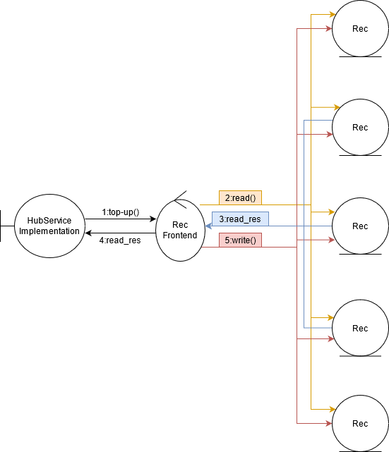

# Relatório do projeto *Bicloin*

Sistemas Distribuídos 2020-2021, segundo semestre

## Autores

**Grupo A03**

| Número | Nome              | Utilizador                                     | Correio eletrónico                              |
|--------|-------------------|------------------------------------------------|-------------------------------------------------|
| 89459  | Henrique Silva    | <https://git.rnl.tecnico.ulisboa.pt/ist189459> | <mailto:henrique.c.silva@tecnico.ulisboa.pt>    |
| 89532  | Rafael Rodrigues  | <https://git.rnl.tecnico.ulisboa.pt/ist189532> | <mailto:rafael.s.rodrigues@tecnico.ulisboa.pt>  |
| 89555  | Tomás Alagoa      | <https://git.rnl.tecnico.ulisboa.pt/ist189555> | <mailto:tomas.alagoa@tecnico.ulisboa.pt>        |

  

### Modelo de faltas

#### Faltas toleradas:

- Registos desatualizados do rec

- Tolera a paragem de f servidores no pior dos casos com f = numero total de servidores / 2

- Terminção de processos com SIGTERM

- Congelamento de processos com SIGTSTP | kill -20 e posteriormente a sua continuação com SIGCONT | kill -18

#### Faltas não toleradas:

- Terminção de processos com SIGKILL | kill -9

- Falhas de rede (ZooKeeper)

- Não garante ordem FIFO

- Falhas bizantinas

### Figura da solução das faltas

### Solução efetuada

- Cliente quer saber o seu saldo inicial e fazer top-up de 10 BIC
    
    - São ligados _N_ recs, que procedem à criação dos seus _RecServiceImpls_ respetivos

    - É criado um hub, que manda uma mensagem a partir de um _RecFrontend_ contendo uma lista com os nomes dos utilizadores a registar a partir do ficheiro _csv_ de utilizadores inicial e um mapa das estações com os respetivos atributos a partir do ficheiro _csv_ de estações inicial. O hub, neste momento, calcula um _quorum_ de recs com _quorum_ = _N_ / 2 + 1.

    - Os recs recebem a mensagem de inicialização concurrentemente, de modo a inicializarem as suas variáveis.

    - É criada uma app para um utilizador poder interagir com o sistema.

    - O utilizador insere o comando 'balance' de modo a poder consultar o seu saldo no momento.

    - O pedido é enviado da app para o hub a partir de um _HubFrontend_. O hub utiliza o _RecFrontend_ para mandar um pedido de leitura para cada rec, mandando _M_ pedidos no total com _M_ sendo o número de recs registados no ZooKeeper no momento em que o pedido é feito. Espera depois pela resposta de _quorum_ recs. Quando o hub recebe _quorum_ respostas, ignora qualquer resposta que esteja ainda em curso e devolve a mensagem com o maior valor de _tag_.

    - O hub devolve a mensagem à app que apresenta o output da seguinte forma: '_utlizador_ _saldo_ BIC'.

    - O utilizador insere o comando 'top-up 1' de modo a poder aumentar o seu saldo em 10 BIC.

    - O pedido é enviado da app para o hub a partir de um _HubFrontend_. O hub utiliza o _RecFrontend_ para mandar um pedido de leitura para cada rec, mandando _M_ pedidos no total. Espera depois pela resposta de _quorum_ recs. Quando o hub recebe _quorum_ respostas, ignora qualquer resposta que esteja ainda em curso e devolve o registo do utilizador com o maior valor de _tag_.

    - É criado um novo pedido de write no _RecFrontend_ com uma _newTag_ = _tag_ + 1. O pedido é mandado para cada rec, mandando _M_ pedidos no total. O hub espera pela resposta de _quorum_ recs e ignora quaisquer respostas adicionais ou pedidos que ainda estejam em curso. No final devolve uma mensagem de confirmação para o utilizador.

    - O hub devolve a mensagem à app que apresenta o output da seguinte forma: '_utlizador_ _novoSaldo_ BIC'.

    - O utilizador insere o comando 'exit' para sair da app.

    - O utilizado manda um sinal SIGTERM para o hub, o que leva à morte do processo que o estava a correr e para cada rec, o que leva ao seu _unbinding_ do ZooKeeper

### Explicação do protocolo utilizado 

- RecFrontend manda _M_ writes para _M_ recs:

    - É efetuado um _updateRecords()_ para atualizar o mapa de recs registados no ZooKeeper no momento.

    - É criado um _ReadRequest_ para obter a _maxTag_ do registo para o qual se pretende escrever,  um mapa _futures_ cuja chave é a instãncia do rec a que o _ListenableFuture_ está ligado e cujo valor é o respetivo _ListenableFuture_, um array _channels_ onde serão guardados os channels utilizado para a comunicação com cada rec respetivo e um _ResponseCollector_ de modo a acumumlar as respostas proveninentes dos recs.

    - É efetuado um _read()_ com o _ReadRequest_ criado anteriormente cujo resultado é guardado num _ReadResponse_ que terá como atributo uma _Tag_ com o número de sequência mais recente do registo.

    - É iterado o mapa de recs e é criado um channel respetivo para cada rec. Esse channel é depois adicionado ao array _channels_ criado anteriormente.

    - É criado um novo _WriteRequest_ com o registo para o qual se pretende escrever algo e a informação que se pretende escrever. É calculada uma nova tag efetaundo a operação _newTag_ = _maxTag_ + 1.

    - O _RecFrontend_ cria _M_ _FutureStubs_, um para cada rec registado no ZooKeeper e coloca os resultados das suas execuções no mapa _futures_ para obtenção de resultados mais tarde. Um _FutureStub_ é um stub assíncrono e que pode ser executado concurrentemente com outros _FutureStubs_ não bloqueando a thread onde está a executar. Quando o stub efetua uma operação, devolve um _ListenableFuture_, que permite a obtenção do resultado do stub, se esse resultado existir, ou seja, se o stub conseguir completar a sua operação dentro de um tempo limite estabelecido anteriormente.

    - Cada _ListenableFuture_ que obtiver uma respoata proveninente da execução do stub adiciona essa mesma resposta ao _responseCollector_ criado anteriormente e um contador de respostas é aumentado.

    - Logo que o programa obtiver _quorum_ respostas, ignora qualquer resposta que ainda esteja em curso. As escritas são asseguradas devido à natureza dos _ListenableFutures_ que, com o método _get()_, garantem o resultado de uma dada operação, se esse resultado existir.

    - Para evitar problemas com futuras operações direcionadas aos recs, após a obtenção dos resultados pretendidos, é executada a função _shutdownChannels()_ que fecha todos os canais abertos e guardados no array _channels_.

### Tabela de dados recolhidos

#### Sem otimizações:

|Nr. Escritas  | Tempo (s) |
|--------------|-----------|
| 20           | 11,327    |
| 40           | 20,240    |
| 60           | 29,176    |
| 80           | 37,286    |
| 100          | 46,537    |
| 120          | 55,013    |

#### Com otimizações:

|Nr. Escritas  | Tempo (s) |
|--------------|-----------|
| 20           | 11,334    |
| 40           | 20,098    |
| 60           | 28,916    |
| 80           | 37,733    |
| 100          | 46,616    | 
| 120          | 55,286    |

### Implementações e otimizações/melhorias

- Na sugestão de implementação da solução para o problema abordado neste projeto optámos pela utilização de protocolos já implementados pelo gRPC, particularmente o _FutureStub_ ao invés de _ServiceStubs_ que necessitariam da implementação de Threads e _ResponseObservers_ para guardar os resultados das operações efetuadas pelos stubs. Deste modo, aumentamos a escalibilidade do programa e a compreensibilidade da implementação da solução para o problema abordado neste projeto.

- Foi também tomada a decisão de implementar um protocolo de Registo Coerente de modo a assegurar dois dos três pilares do CAP (Coherence, Accessibility, Partition Tolerance), a coerência e a acessibilidade. Estes dois pilares são mantidos a partir da implementação de tags para cada registo e de um quorum de recs. O quorum assegura que o programa recebe sempre pelo menos _quorum_ respostas com _quorum_ calculado da seguinte forma: _quorum_ = _nrRecsRegistados_ / 2 + 1. Quando o programa recebe _quorum_ respostas, compara as tags de cada resposta de modo a assegurar que o registo na resposta enviada de volta para o utilizador é o mais recente.